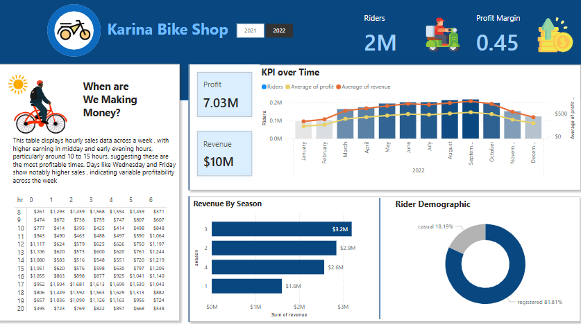

# 🍕 Bike Shop Report with Power BI & SQL Server

  

## 📌 Project Overview  
This project analyzes bike sales using **CSV data** imported into **SQL Server**. Queries were executed in SQL Server to extract key metrics, and the results were visualized in **Power BI**.

  

